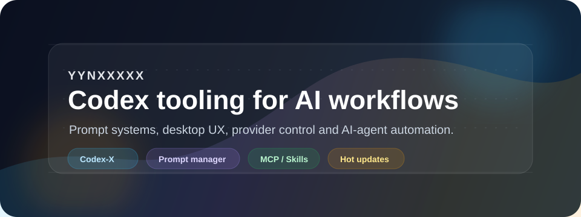
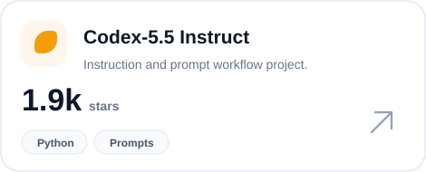
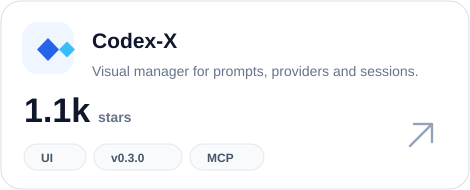

  

  <a href="https://github.com/yynxxxxx/Codex-5.5-codex-instruct-5.5">Codex-5.5</a>
   · 
  <a href="https://github.com/yynxxxxx/Codex-X">Codex-X</a>
   · 
  <a href="https://github.com/yynxxxxx/Codex-X/releases">Latest release</a>
   · 
  <a href="https://github.com/yynxxxxx/Codex-X/issues">Feedback</a>

## Focus

I build practical Codex tooling around visual prompt management, provider switching, session workflows, Skills, MCP and local AI-agent automation.

## Featured

  
  

## Snapshot

  
  
  
  

